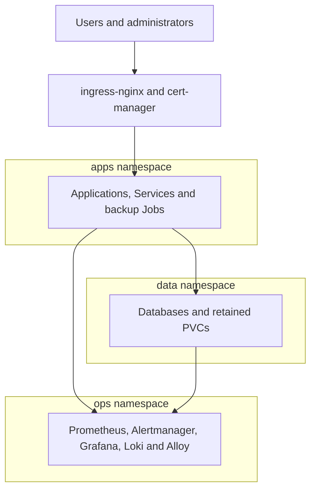
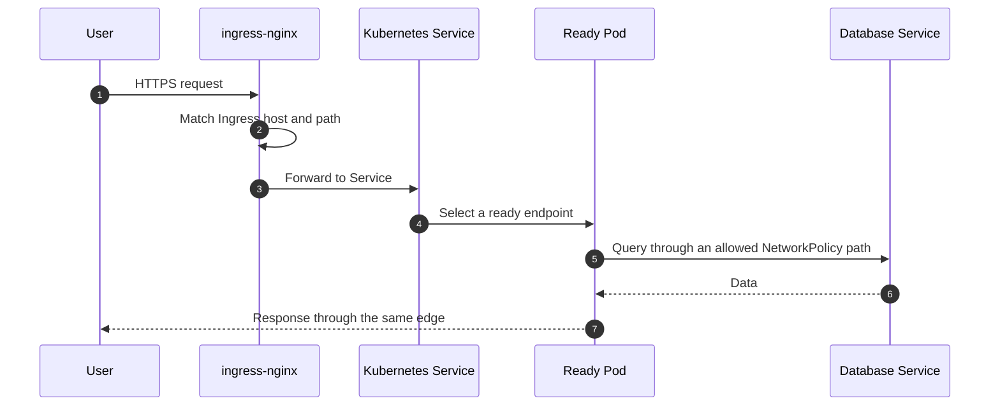
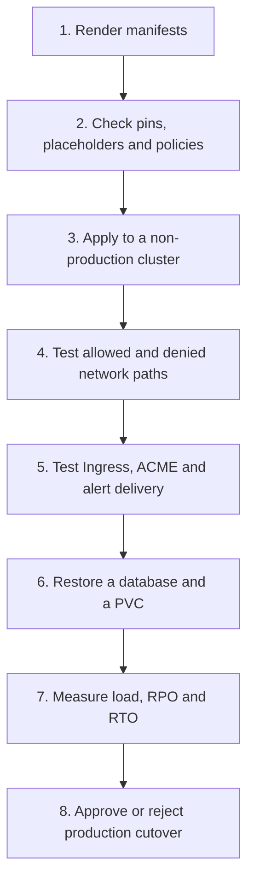

# Architecture diagrams

## Platform zones

```mermaid
flowchart TB
    U[Users and administrators]
    I[ingress-nginx and cert-manager]

    subgraph APPS[apps namespace]
        A[Applications, Services and backup Jobs]
    end

    subgraph DATA[data namespace]
        D[Databases and retained PVCs]
    end

    subgraph OPS[ops namespace]
        O[Prometheus, Alertmanager, Grafana, Loki and Alloy]
    end

    U --> I
    I --> A
    A --> D
    A --> O
    D --> O
```

## Request path

```mermaid
sequenceDiagram
    autonumber
    participant U as User
    participant I as ingress-nginx
    participant S as Kubernetes Service
    participant P as Ready Pod
    participant D as Database Service

    U->>I: HTTPS request
    I->>I: Match Ingress host and path
    I->>S: Forward to Service
    S->>P: Select a ready endpoint
    P->>D: Query through an allowed NetworkPolicy path
    D-->>P: Data
    P-->>U: Response through the same edge
```

## Production evidence ladder

```mermaid
flowchart TB
    A[1. Render manifests]
    B[2. Check pins, placeholders and policies]
    C[3. Apply to a non-production cluster]
    D[4. Test allowed and denied network paths]
    E[5. Test Ingress, ACME and alert delivery]
    F[6. Restore a database and a PVC]
    G[7. Measure load, RPO and RTO]
    H[8. Approve or reject production cutover]

    A --> B --> C --> D --> E --> F --> G --> H
```

